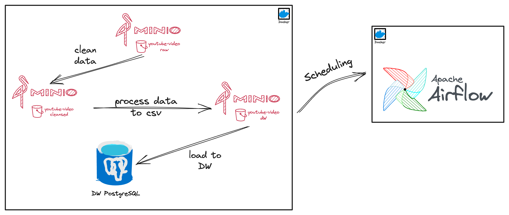
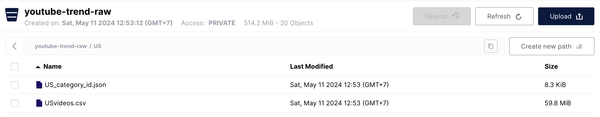
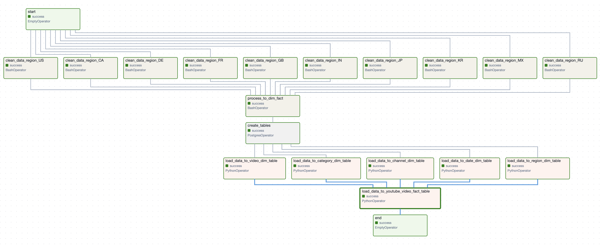

## Description

This repo design ETL pipeline to ingest YouTube data into data warehouse.
This pipline is scheduled by using Apache Airflow

- This data warehouse help to find out what videos, categories...are of most interest based on views, likes, dislikes.

- This will be helpful in enabling YouTube reach some of its analytical goals, make some business decision that will
  improve user experiences.

## About the dataset

- This dataset includes several months (and counting) of data on daily trending YouTube videos. Data is included for the
  US, GB, DE, CA, and FR regions (USA, Great Britain, Germany, Canada, and France, respectively), with up to 200 listed
  trending videos per day.
- Each region’s data is in a separate file. Data includes the video title, channel title, publish time, tags, views,
  likes
  and dislikes, description, and comment count.
  
- The data also includes a `category_id` field, which varies between regions. To retrieve the categories for a specific
  video, find it in the associated `JSON`. One such file is included for each of the five regions in the dataset.

Source: [Kaggle - Trending YouTube Video Statistics](https://www.kaggle.com/datasets/datasnaek/youtube-new)

## Data warehouse design

## ETL Pipeline

